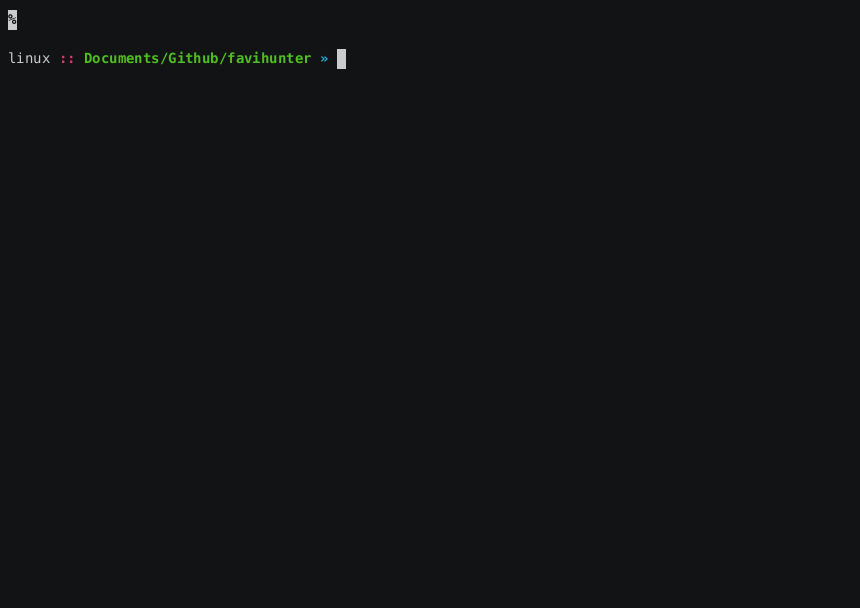

# Favihunter

> Favicons are tiny icons used by modern web applications. When combined with search engines, they’re great pivots for discovering related internet assets.

This tool helps security practitioners find assets using favicon hashes across multiple search engines:

- [Censys](https://search.censys.io/)
- [Criminal IP](https://www.criminalip.io/) 
- [FOFA](https://en.fofa.info/)
- [Hunter-How](https://hunter.how/)
- [Netlas](https://app.netlas.io)
- [Odin](https://search.odin.io/)
- [Shodan](https://www.shodan.io) 
- [Silent Push](https://explore.silentpush.com) 
- [Validin](https://app.validin.com)
- [VirusTotal](https://virustotal.com)
- [Zoomeye](https://www.zoomeye.ai)

## 🛠️ Installation

### Option A — PyPI (standard)

```bash
pip install favihunter
```

### Option B — pipx (isolated CLI install) — **recommended for command-line tools**

```bash
# install pipx if you don’t have it
python3 -m pip install --user pipx
python3 -m pipx ensurepath  # then restart your shell

# install favihunter
pipx install favihunter

# upgrade later
pipx upgrade favihunter

# run without installing (one-shot)
pipx run favihunter --help
```

### Option C — From source (Poetry)

```bash
git clone https://github.com/eremit4/favihunter.git
cd favihunter
poetry install
```

> Using a virtual environment is recommended to avoid dependency conflicts.

## ⚡ Quickstart

```bash
favihunter --url https://python.org
```

Favihunter downloads the favicon, computes hashes (MMH3, MD5, SHA256, and optional perceptual hash), and prints ready-to-click search URLs.

## 🕵️‍♂️ Usage

```bash
favihunter --help
```

Analyze a single URL:

```bash
favihunter --url <url>
```


Analyze a file with URLs (one per line):

```bash
favihunter --urls <file>
```

Analyze a local favicon file:

```bash
favihunter --favicon <path/to/favicon.ico>
```

Clean the temp folder:

```bash
favihunter --remove
```

VirusTotal pivot:

```bash
favihunter --url <url> --virus-total
```


> ## ✅ Requirements

* Python **3.8+**
* Linux/macOS (Windows is likely fine via PowerShell; please open an issue if you hit problems)

## 🧹 Uninstall / Upgrade

**pip**

```bash
pip install --upgrade favihunter
pip uninstall favihunter
```

**pipx**

```bash
pipx upgrade favihunter
pipx uninstall favihunter
```


